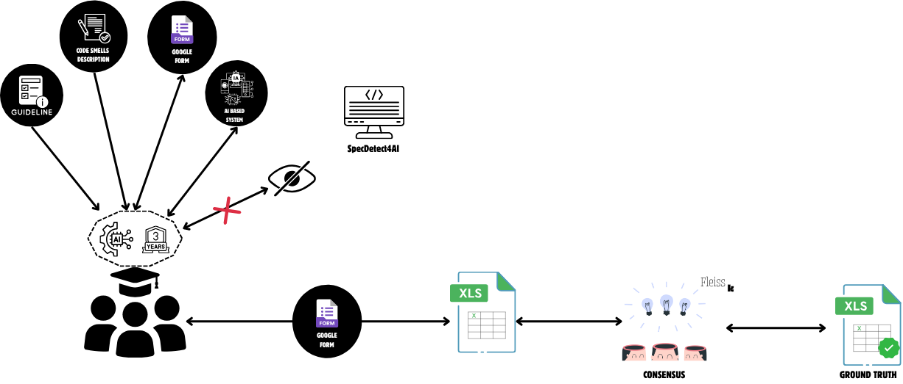

# Ground Truth Construction for AI-Specific Code Smells

This document describes the methodology used to construct the ground truth dataset for evaluating the SpecDetect4AI tool. It complements Section IV.D of our article submission.

---

## 1. Rationale and System Selection

To evaluate our tool on real-world code, we built a manually labeled dataset of AI-specific code smells. Because no public benchmark exists, we selected the open-source project **mlflow** as the initial evaluation target. This choice was made randomly from our full dataset of 826 AI-based GitHub systems (stratified by recency, popularity, and maintenance) and the stratification process is available here: `Evaluation/Ground_Truth_Construction_Process/Statistical_Sampling`.

### Representativeness of mlflow

We assessed the **structural and architectural complexity** of mlflow compared to the rest of our dataset. Our analysis reveals that:

| Metric                      | mlflow       | Global Mean | Ratio    |
|----------------------------|--------------|-------------|----------|
| Number of functions        | 8.53         | 7.25        | 1.18×    |
| Max function nesting depth | 1.01         | 0.89        | 1.14×    |
| Number of classes          | 0.96         | 1.02        | 0.94×    |
| Number of assignments      | 26.14        | 35.02       | 0.75×    |
| Pipeline pattern frequency | 0.067        | 0.032       | **2.07×**|
| Custom pipeline classes    | 0.0007       | 0.0035      | 0.19×    |
| Lines of code (LOC)        | 210.16       | 189.71      | 1.11×    |
| % files with dynamic logic| 8.57%        | 9.15%       | 0.94×    |

These findings indicate that **mlflow exhibits higher complexity than the average project**, especially in terms of pipeline-related patterns and nesting. Thus, we consider mlflow a **representative and challenging** subject for static analysis of AI-specific smells.

---

## 2. Annotation Protocol

The ground truth was created following a **two-pass, blinded annotation protocol**, inspired by prior work on smell datasets ([4], [28]).

### 2.1 Annotators

- **Participants**: 3 graduate (Master’s) students with up to 3 years of experience in AI-based development.
- **Training**: All were trained using detailed **annotation guidelines**, **examples**, and access to formal **code smell descriptions**. To see **annotation guidelines**, you just need to follow the `Evaluation/Ground_Truth_Construction_Process/Search-Manual-Code-Smell-framework.html`. The **examples** and **code smell descriptions** are available through `https://hynn01.github.io/ml-smells/` and through this article : `https://dl.acm.org/doi/10.1145/3522664.3528620`
- **Blindness**: Annotators had no knowledge of the outputs or internals of the SpecDetect4AI tool.

### 2.2 Workflow

Below is the graphical representation of our workflow (included as `Ground_Truth_Construction.png`):

**Steps:**

1. **Preparation**
   - Provide guidelines, code smell descriptions, and annotation instructions.
2. **Independent Annotation**
   - Each annotator filled a structured **Google Form** for each file.
   - Smells were assessed at file-level granularity (and optionally line-level).
3. **Consolidation**
   - Annotations were merged into a master spreadsheet (`Evaluation/Comparison_Other_Tools/GroundTruth_Manual_Eval.xlsx`).
   - Consensus was reached manually when discrepancies arose.
4. **Agreement Measurement**
   - We computed **Fleiss’ κ** across all annotations to assess reliability.

---

## 3. Inter-Annotator Agreement

To assess the consistency and reliability of the manual annotations, we computed **Fleiss’s Kappa (κ)** — a standard measure of inter-rater agreement for categorical variables when more than two annotators are involved.

### 3.1. Mathematical Definition

Let:
- \( N \) be the number of annotated items (e.g., source files),
- \( n \) the number of annotators per item (here: \( n = 3 \)),
- \( k \) the number of categories (binary: presence or absence of a smell),
- \( n_{ij} \) the number of annotators who assigned item \( i \) to category \( j \).

Then, for each item \( i \), the agreement score is:

**Per-item agreement:**

$$
P_i = \frac{1}{n(n - 1)} \sum_{j = 1}^{k} n_{ij}(n_{ij} - 1)
$$

**Overall observed agreement:**

$$
\bar{P} = \frac{1}{N} \sum_{i=1}^{N} P_i
$$

**Expected agreement by chance:**

$$
\bar{P_e} = \sum_{j=1}^{k} p_j^2 \quad \text{with} \quad p_j = \frac{1}{Nn} \sum_{i=1}^{N} n_{ij}
$$

**Fleiss’s Kappa:**

$$
\kappa = \frac{\bar{P} - \bar{P_e}}{1 - \bar{P_e}}
$$

A value of $$kappa = 1 $$ indicates perfect agreement, while $$kappa = 0 $$ corresponds to agreement at chance level.

---

### 3.2. Interpretation Scale

Following the widely accepted scale of **Landis and Koch (1977)**, the interpretation of κ values is as follows:

| Fleiss’ κ             | Agreement Level         |
|------------------------|--------------------------|
| < 0.00                | Poor (less than chance)  |
| 0.00 – 0.20           | Slight                   |
| 0.21 – 0.40           | Fair                     |
| 0.41 – 0.60           | Moderate                 |
| 0.61 – 0.80           | Substantial              |
| 0.81 – 1.00           | Almost perfect           |

---

### 3.3. Results

Based on annotations from three Master's students with advanced experience in ML engineering, we obtained:

- **Overall Fleiss’s κ = 0.85**, indicating *near-perfect agreement*.
- **Per-smell κ range**: from **0.78** to **0.89**, suggesting consistently high agreement across most categories.

These results demonstrate that the annotation protocol — including the structured guidelines, independent labeling, and consensus consolidation — led to a reliable and reproducible ground truth.

---

## 4. Dataset Overview

- **241 files** annotated.
- **199 confirmed smell instances** across 22 AI-specific smells.
- Stored in: `Evaluation/Comparison_Other_Tools/GroundTruth_Manual_Eval.xlsx`.

Each row = a file; each column = a smell; each filled cell = confirmed instance (with supporting line info when available).

---

## 5. Location of related files
-  `Evaluation/mlflow_complexity` – Complexity calculation of mlflow compared to all dataset 
-  `Evaluation/Comparison_Other_Tools/GroundTruth_Manual_Eval.xlsx` – Final ground truth table  
-  `Evaluation/Ground_Truth_Construction_Process` – Full annotation guide  
-  `Evaluation/Ground_Truth_Construction_Process/Fleiss_Kappa.txt` – Fleiss’ κ per file 
-  `static/Ground_Truth_Construction.png` – Workflow overview  

---

